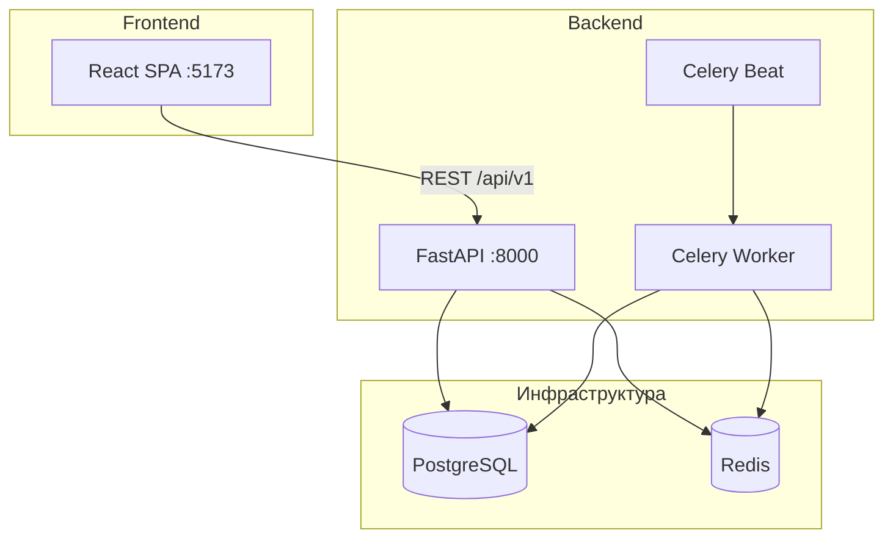

# Finance Tracker

Приложение для учёта личных финансов: доходы и расходы, несколько счетов, бюджеты, цели, кэшбэк, аналитика и in-app уведомления. Монорепозиторий из двух частей — **backend** (FastAPI) и **frontend** (React).

| Часть | Путь | Назначение |
|-------|------|------------|
| Backend | [`backend/`](backend/) | REST API, бизнес-логика, БД, фоновые задачи |
| Frontend | [`frontend/finance-tracker/`](frontend/finance-tracker/) | SPA для пользователя |

Подробная документация API и эндпоинтов — в [backend/README.md](backend/README.md). Запуск и структура фронтенда — в [frontend/finance-tracker/README.md](frontend/finance-tracker/README.md).

---

## Возможности

### Учётная запись и безопасность

- Регистрация и вход по email и паролю
- JWT: access-токен + refresh с ротацией и отзывом при logout
- Сброс пароля (запрос токена / смена по токену; в dev режиме токен может вернуться в ответе)
- Изоляция данных: у каждого пользователя свой набор сущностей (`user_id` на всех записях)
- Rate limit на маршруты `/auth/*`

### Счета (финансовые)

- Несколько счетов на пользователя: дебетовый, кредитный, наличные, сберегательный
- Стартовый баланс (`initial_balance`) и **текущий баланс** из проводок (ledger), без хранения баланса в таблице счёта
- CRUD счетов, мягкое удаление

### Транзакции

- Типы: **расход**, **доход**, **перевод** между своими счетами
- Привязка к счёту, категории, тегам; описание, магазин, дата, заметки
- Перевод создаёт пару операций с общим `transfer_group_id`
- Список с фильтрами (тип, счёт, категория, тег, период, поиск), сортировка и пагинация
- Редактирование метаданных (описание, теги) без смены суммы и счёта
- **Исправление** (`correct`): старая операция soft-delete, новая с `correction_of_id` и при необходимости новой суммой/счётом/категорией
- Опциональная привязка карты при расходе — для расчёта кэшбэка

### Категории и теги

- Категории **расходов** и **доходов**, дерево (родитель / дочерние)
- Цвет, иконка (имя из набора Lucide), флаг «обязательный расход» для аналитики
- Теги — гибкая разметка операций, уникальны в рамках пользователя

### Бюджеты

- Лимит по категории расходов на период: неделя / месяц / год
- Статус: потрачено, остаток, % использования, прогноз превышения
- Опциональный перенос остатка на следующий период (`rollover`)
- Фоновая проверка лимитов → уведомления при приближении и превышении
- **Рекомендации по лимитам** — см. [алгоритм рекомендаций по бюджетам](#рекомендации-по-бюджетам-эвристика); UI на странице «Бюджеты»

### Повторяющиеся операции (подписки)

- Шаблоны: частота (день / неделя / месяц / год), интервал, сумма, счёт, категория
- Активация / пауза, дата окончания
- Celery создаёт реальные транзакции по расписанию (`next_execution_date`)

### Кэшбэк

- Карты, привязанные к счёту (банк, последние 4 цифры)
- Правила: категория → процент, период действия, месячный лимит
- Автоначисление при расходе с категорией (и опционально указанной картой)
- Сводка накопленного кэшбэка, список упущенного, рекомендация лучшей карты для категории
- Выплата кэшбэка за прошлый месяц по карте — доходной операцией в категории «Кэшбэк», с возможностью скорректировать сумму

### Финансовые цели

- Целевая сумма, срок, статус (активна / достигнута / отменена)
- Опциональная привязка к счёту — прогресс синхронизируется с балансом счёта
- Фоновое напоминание о приближающемся дедлайне

### Аналитика

- **Дашборд**: общий баланс, доходы/расходы за месяц, норма сбережений, кэшбэк, прогресс целей
- **Статистика**: топ категорий расходов/доходов, cashflow, средние траты/доходы
- **Heatmap** активности по дням (как на GitHub)
- **Коэффициенты**: норма сбережений, доля расходов в доходах, доля необязательных трат
- **Прогноз на следующий месяц**: доход, расход и денежный поток (FCF) — см. [алгоритм прогноза](#прогноз-на-следующий-месяц-эвристика) ниже
- Опция **«Без категории „Инвестиции“»** — исключает покупку активов из расходов, графиков и прогноза (как в аналитике)

### Уведомления (in-app)

- Создаются системой (бюджеты, подписки, цели, кэшбэк) — публичного API создания нет
- Типы: предупреждение/превышение бюджета, создана повторяющаяся операция, дедлайн цели, доступен кэшбэк
- Список с пагинацией, фильтр непрочитанных, отметить одно / все прочитанными

### ИИ-рекомендации (LLM)

- Страница **«Рекомендации»**: текстовый разбор выбранного месяца на русском (markdown)
- **Не машинное обучение** и не прогноз цифр — отдельный сервис от блока прогноза в аналитике
- Backend собирает JSON за месяц (сводка, топ категорий, до 500 транзакций) и отправляет запрос в [OpenRouter](https://openrouter.ai/) (`POST /api/v1/ai/recommendations`)
- Модель задаётся в `.env`: `OPENROUTER_API_KEY`, `OPENROUTER_MODEL` (по умолчанию `google/gemma-4-31b-it:free`)
- Без ключа API возвращает `503` (`AI_NOT_CONFIGURED`)

### Frontend (интерфейс)

- Тёмная тема, адаптивная вёрстка (мобильное меню-drawer)
- Страницы: дашборд, транзакции, счета, категории, теги, бюджеты, подписки, кэшбэк, цели, аналитика, рекомендации (ИИ), уведомления
- Визуальный выбор цвета (color picker) и иконок для категорий
- Графики Recharts, колокольчик уведомлений в шапке
- Автообновление access-токена при 401

---

## Архитектура



**Слои backend:** Routes → Services → Repositories → Models (ORM).

**Баланс счёта:** `initial_balance` + сумма проводок `ledger_entries` (двойная запись: debit/credit на операцию). Финансовые сущности удаляются мягко (`deleted_at`).

**Пользователь (`User`)** — не «отдельный модуль без связей», а владелец всех данных: JWT `sub` → фильтрация по `user_id` на каждом запросе.

---

## Прогноз на следующий месяц (эвристика)

Прогноз доходов, расходов и **FCF** (операционный денежный поток: доходы − расходы, без переводов между счетами) строится **детерминированными правилами** в `backend/app/services/forecast.py`. Модели ML нет, веса не обучаются.

**Эндпоинт:** `GET /api/v1/analytics/forecast`  
**Параметры:** `exclude_investments` (как в аналитике), опционально `month=YYYY-MM` (по умолчанию — следующий календарный месяц; прошлые и текущий месяц недоступны).

### Состав прогноза

Прогноз складывается из двух независимых частей; итог по каждой стороне (доход / расход):

```
прогноз = повторяющиеся (recurring) + тренд (trend)
FCF = прогноз_доход − прогноз_расход
```

| Часть | Что считается |
|-------|----------------|
| **recurring** | Активные шаблоны из `recurring_transactions` (доход/расход; переводы не учитываются). Для целевого месяца симулируется число срабатываний по `frequency` / `interval` (та же функция `advance_date`, что у Celery). Сумма: `amount × количество срабатываний`. Для будущего месяца отсчёт от `next_execution_date`. |
| **trend** | Среднее за **3 календарных месяца** перед целевым. По каждому месяцу: `переменная_часть = max(0, факт_из_транзакций − оценка_recurring_за_тот_же_месяц)`. Тренд = `(var₁ + var₂ + var₃) / 3`. |

Фактические суммы за историю берутся так же, как в аналитике (`AnalyticsService._sum_income_expenses`), с тем же исключением категории «Инвестиции», если включён флаг.

### Уверенность (`confidence`)

Эвристика по полноте истории (не доверительный интервал модели):

| Значение | Условие |
|----------|---------|
| `high` | Есть данные хотя бы в 3 из 3 месяцев истории |
| `medium` | Есть данные в 1–2 месяцах |
| `low` | Нет данных за историю |

### Отличие от других «рекомендаций»

| | Прогноз (`/analytics/forecast`) | Бюджеты (`/budgets/recommendations`) | ИИ (`/ai/recommendations`) |
|--|----------------------------------|--------------------------------------|----------------------------|
| Тип | Формулы + среднее | Формулы по категориям | LLM через OpenRouter |
| Результат | Доход / расход / FCF на месяц | Лимит по категории | Текст (markdown) |
| Обучение | Нет | Нет | Нет (готовая модель по API) |

---

## Рекомендации по бюджетам (эвристика)

Подсказки лимитов по категориям расходов строятся **только из транзакций** в `backend/app/services/budget_recommendations.py`. LLM и прогноз cashflow здесь не используются.

**Эндпоинт:** `GET /api/v1/budgets/recommendations`  
**UI:** блок «Рекомендации по бюджетам» на странице «Бюджеты»; кнопки открывают форму создания/редактирования с уже подставленной суммой.

### Входные данные

- Период: **последние 3 календарных месяца** (включая текущий).
- Только **расходы** с привязкой к категории; удалённые категории и операции не учитываются.
- По каждой категории агрегируются суммы и число операций **по месяцам** (SQL `GROUP BY` год/месяц/категория).

### Пороги (категория попадает в расчёт)

| Параметр | Значение |
|----------|----------|
| Минимум трат за 3 мес. | 500 ₽ |
| Минимум операций | 2 |

### Предлагаемый лимит (всегда месячный)

```
база = max(среднее_за_месяц, пик_за_месяц × 0.85)
лимит = округление_вверх_до_10_₽(база × 1.15)
```

«Среднее за месяц» — среднее суммарных трат категории по календарным месяцам периода (месяцы без трат входят как 0). Запас **15%** заложен в множитель `1.15`.

### Типы рекомендаций

| Тип | Условие |
|-----|---------|
| **create** | По категории ещё нет бюджета |
| **increase** | Есть **месячный** бюджет; средние траты ≥ **90%** лимита; предложенный лимит **выше** текущего |
| **decrease** | Есть **месячный** бюджет; средние траты ≤ **45%** лимита; предложенный лимит **ниже** текущего |

Для **недельных** и **годовых** бюджетов корректировка (`increase` / `decrease`) не предлагается — только создание нового месячного лимита, если бюджета по категории нет. Сравнение «траты vs лимит» для месячных бюджетов идёт напрямую; для других периодов лимит приводится к месячному эквиваленту (`× 52/12` или `/ 12`), но типы increase/decrease всё равно только для `period_type = monthly`.

В ответе — до **12** пунктов, сортировка по убыванию средних трат. В каждом пункте: категория, тип, предложенный лимит, среднее/пик, число операций, текстовое **reason** на русском.

### Пример ответа (поля)

- `recommendation_type`: `create` | `increase` | `decrease`
- `suggested_amount_limit`, `suggested_period_type` (сейчас всегда `monthly`)
- `avg_monthly_spent`, `max_monthly_spent`, `transaction_count`, `months_with_activity`
- `existing_budget_id`, `current_amount_limit` — для increase/decrease
- `period_from`, `period_to`, `months_analyzed` — в обёртке ответа

---

## ИИ-рекомендации (LLM)

Сервис: `backend/app/services/ai_recommendations.py`.

1. Пользователь выбирает месяц `YYYY-MM` (только прошедшие и текущий, не будущие).
2. Backend загружает транзакции за период, статистику и категории, формирует JSON-контекст (сводка, топ-8 расходов/доходов, список операций; не более 500 записей в промпте).
3. Запрос уходит в OpenRouter Chat Completions с системным промптом «персональный финансовый советник» и ответом на русском в markdown.
4. Frontend рендерит ответ через `react-markdown` + `remark-gfm`.

**Настройка (backend `.env`):**

```env
OPENROUTER_API_KEY=sk-or-...
OPENROUTER_MODEL=google/gemma-4-31b-it:free
```

Модель можно сменить на любую, поддерживаемую OpenRouter. Температура и `max_tokens` зафиксированы в коде сервиса.

ИИ **не участвует** в расчёте прогноза (аналитика) и лимитов по бюджетам; при желании в промпт можно было бы подставлять уже посчитанные цифры — сейчас этого нет.

---

## Стек технологий

| Backend | Frontend |
|---------|----------|
| Python 3.13+, FastAPI | React 19, TypeScript, Vite |
| PostgreSQL, SQLAlchemy 2 async | React Router, TanStack Query |
| Alembic | Axios, React Hook Form, Zod |
| Redis, Celery | Recharts, Lucide, Sonner, date-fns |
| JWT (HS256), slowapi | react-colorful, react-markdown |
| OpenRouter (опционально, ИИ-рекомендации) | — |

---

## Быстрый старт (полный стек)

### Вариант 1: Docker (рекомендуется для backend)

```bash
cd backend
cp .env.example .env
docker compose up -d postgres redis --wait
docker compose run --rm --no-deps api alembic upgrade head
docker compose up -d --build
```

Поднимутся: PostgreSQL, Redis, API (`http://localhost:8000`), Celery worker и beat. Миграции применяйте вручную командой выше (или повторно после обновлений схемы).  
Документация API: [http://localhost:8000/docs](http://localhost:8000/docs)

### Вариант 2: Backend локально

Postgres и Redis в compose по умолчанию доступны только внутри Docker-сети. Для доступа с хоста один раз:

`cp docker-compose.override.example.yml docker-compose.override.yml`

```bash
cd backend
cp .env.example .env
docker compose up -d postgres redis
pip install -r requirements-dev.txt
alembic upgrade head
uvicorn app.main:app --reload
```

### Frontend

```bash
cd frontend/finance-tracker
npm install
npm run dev
```

Откройте [http://localhost:5173](http://localhost:5173). Dev-сервер проксирует `/api` на `http://localhost:8000`.

Другой URL API:

```bash
VITE_API_BASE_URL=https://your-api.example.com/api/v1 npm run dev
```

### Порты по умолчанию

| Сервис | Порт на хосте |
|--------|----------------|
| Frontend (Vite) | 5173 |
| Backend API (Docker) | 8000 |
| PostgreSQL, Redis | только внутри сети compose; с хоста — через `docker-compose.override.yml` (см. `backend/docker-compose.override.example.yml`) |

---

## Фоновые задачи (Celery)

| Задача | Назначение |
|--------|------------|
| `process_recurring_transactions` | Создание транзакций из активных шаблонов подписок |
| `check_budgets` | Проверка бюджетов, уведомления о лимите |
| `check_goal_deadlines` | Напоминания о сроках целей |

Запускаются через **Celery Beat** по расписанию (нужны Redis и worker из `docker compose`).

---

## API (кратко)

- Базовый префикс: `/api/v1`
- Формат: `{ "success": true, "data": ..., "message": "" }` или `{ "success": false, "error": { "code", "message", "details" } }`
- Защищённые маршруты: заголовок `Authorization: Bearer <access_token>`

| Группа | Префикс |
|--------|---------|
| Auth | `/api/v1/auth` |
| Счета | `/api/v1/accounts` |
| Категории | `/api/v1/categories` |
| Теги | `/api/v1/tags` |
| Транзакции | `/api/v1/transactions` |
| Бюджеты | `/api/v1/budgets` (в т.ч. `GET /recommendations`) |
| Подписки | `/api/v1/recurring` |
| Кэшбэк | `/api/v1/cashback` |
| Цели | `/api/v1/goals` |
| Аналитика | `/api/v1/analytics` (в т.ч. `GET /forecast`) |
| ИИ | `/api/v1/ai` (`POST /recommendations`) |
| Уведомления | `/api/v1/notifications` |
| Health | `/health` |

Полные таблицы полей и query-параметров — в [backend/README.md](backend/README.md).

---

## Структура репозитория

```
finance-tracker/
├── README.md                 ← этот файл
├── backend/
│   ├── app/                  # FastAPI: api, services, models, repositories
│   ├── alembic/              # миграции БД
│   ├── tests/
│   ├── docker-compose.yml
│   └── README.md
└── frontend/
    └── finance-tracker/      # React SPA (package.json здесь)
        ├── src/
        └── README.md
```

---

## Тесты и качество кода (backend)

```bash
cd backend
pip install -r requirements-dev.txt
pytest -v
ruff check app tests
```

Docker-тесты: `docker compose --profile test run --rm test`

---

## Лицензия и статус

Pet-проект для личного учёта финансов. Перед продакшеном смените `JWT_SECRET_KEY` и пароли в `.env`, отключите `DEBUG`, настройте CORS и HTTPS.
